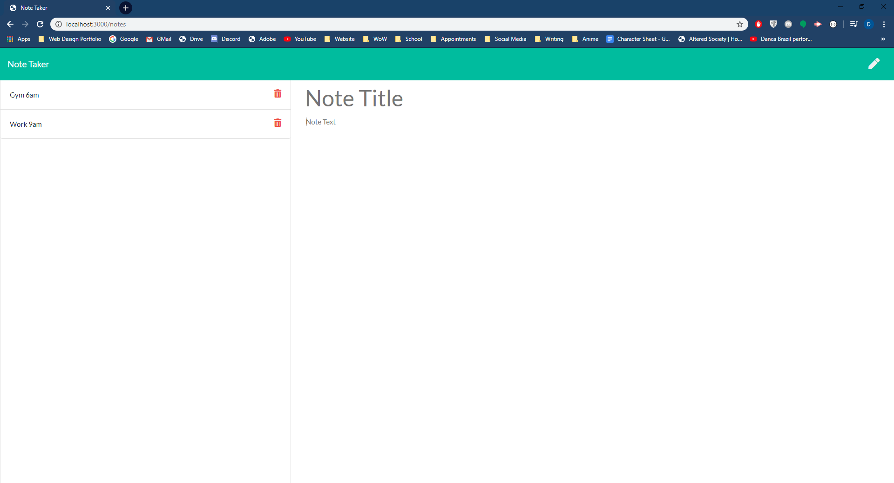

# notetaker
Note taking application

 &nbsp;&nbsp;&nbsp; 	  &nbsp;&nbsp;&nbsp; 	     &nbsp;&nbsp;&nbsp; 	  

## Description  

  * This application creates a web server and api for managing notes
 
## Screenshots 

## Built With  

* Node.js
* Path - module for interacting with the file system
* FS - module for reading and writing to files
* Express -  Node.js web application framework for creating web servers
* CSS
* Bootstrap Framework
* HTML
